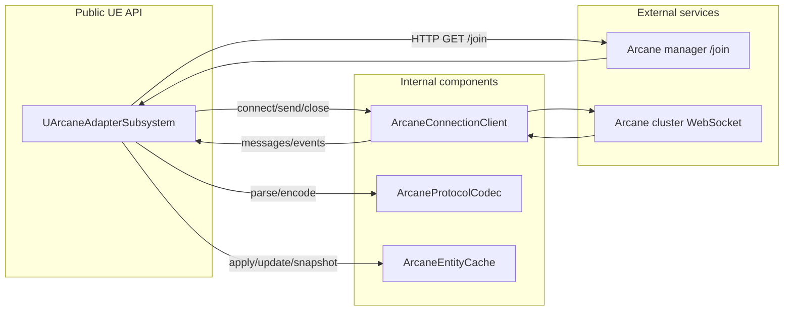

# Arcane Client module interactions

This page maps plugin internals to responsibilities and data flow.

## Responsibility summary

- `UArcaneAdapterSubsystem`: lifecycle orchestration, retry policy/state machine, Blueprint-facing API.
- `ArcaneConnectionClient`: WebSocket transport wrapper and callback wiring.
- `ArcaneProtocolCodec`: join/state JSON parsing and player-state JSON encoding.
- `ArcaneEntityCache`: snapshot storage and interpolation logic for render-time reads.

## Stability note

External compatibility target is the subsystem API and backend protocol expectations (manager join shape, cluster state payloads). Internal class boundaries are implementation details and may evolve.
