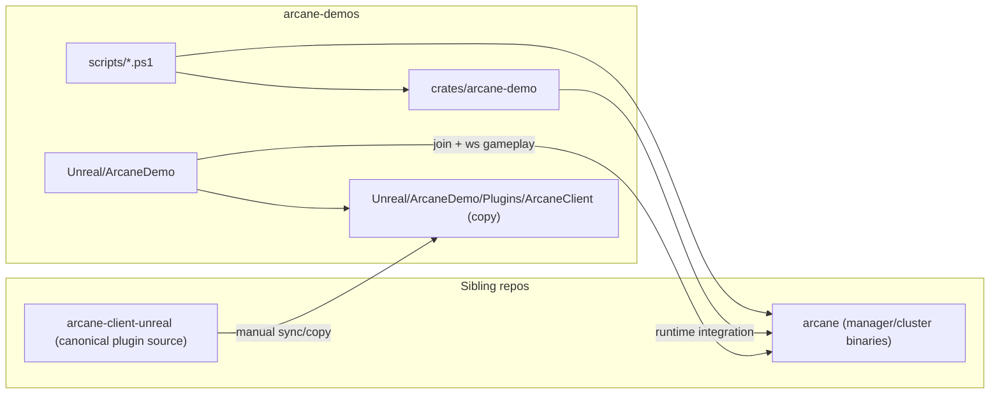

# arcane-demos module interactions

This page focuses on repository boundaries and demo composition.

## Responsibility summary

- `scripts/`: developer workflows (run demo, benchmark, verification).
- `crates/arcane-demo`: backend demo logic and demo binaries.
- `Unreal/ArcaneDemo`: playable UE project for manual/verification runs.
- `Unreal/ArcaneDemo/Plugins/ArcaneClient`: vendored plugin copy used by this project.

## Boundary rules

- Canonical plugin development happens in `arcane-client-unreal`; this repo uses a copied snapshot.
- `arcane-demos` is integration-oriented: it should demonstrate usage of `arcane`/plugin contracts, not redefine them.
- Generated outputs should stay under dedicated output roots and `.gitignore` policies.
